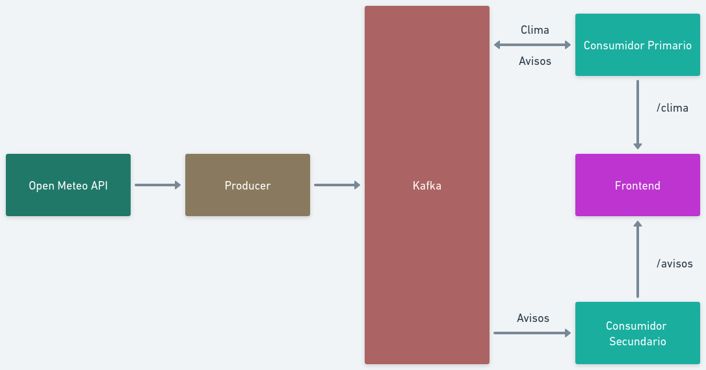

# Trabalho-1-SOE

## Para Rodar (Linux):

Primeiro, iniciar o zookeper e o kafka-server:

```
zookeeper-server-start.sh /opt/kafka/config/zookeeper.properties
```

```
kafka-server-start.sh /opt/kafka/config/server.properties.properties
```

Depois disso, criar os tópicos "clima" e "avisos":

```
kafka-topics.sh --create --topic clima --bootstrap-server localhost:9092
```

```
kafka-topics.sh --create --topic avisos --bootstrap-server localhost:9092
```

Agora, ligar o produtor, que irá gerar dados para o Kafka a cada uma hora:

```
python3 backend/producer/producer.py
```

E os 2 consumidores:

```
python3 backend/consumer/consumer-api.py
```

Por fim, basta subir a interface web:

```
cd frontend
npm install
npm start
```

A aplicação estará disponível em localhost:8000



## Imagens

Dentro do diretório images, encontram-se imagens do frontend do sistema.